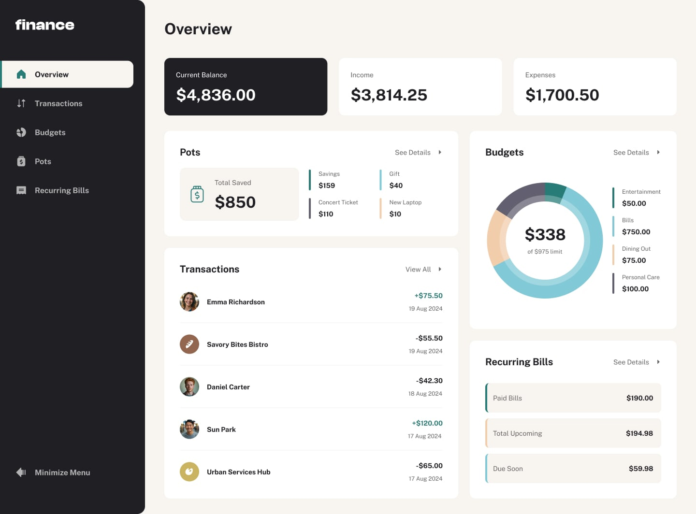

# Personal Finance App

Aplicação web para gestão de finanças pessoais, construída com Nuxt 3, Tailwind CSS e SSG.

## Funcionalidades

- Visão geral rápida dos dados financeiros pessoais  
- Página de transações com paginação (10 por página)  
- Pesquisa, ordenação e filtragem de transações  
- CRUD de orçamentos e cofres de poupança  
- Visualização das últimas transações por categoria  
- Monitoramento do progresso dos cofres  
- Adição e retirada de valores nos cofres  
- Gerenciamento e visualização de contas recorrentes  
- Navegação completa por teclado para acessibilidade  
- Layout responsivo para dispositivos móveis, tablets e desktop  

## Tecnologias e Ferramentas

- **Nuxt 3** com **SSG** para melhor performance e SEO  
- **Tailwind CSS** para estilização rápida e responsiva  
- **TypeScript** para tipagem segura  
- **Pinia** — Gerenciador de estado moderno e oficial do Vue  
- **VueUse** — Coleção de composables úteis para lógica reativa e hooks  
- **Motion One** — Biblioteca para animações performáticas  
- **Nuxt Auth** ou implementação manual com middleware e JWT para autenticação  
- **ESLint** com plugin stylistic para qualidade de código  

## Como rodar o projeto

```bash
# Instalar dependências
npm install

# Rodar em modo desenvolvimento
npm run dev

# Build para produção (SSG)
npm run generate

# Preview do build estático
npm run preview

# Verificar qualidade do código
npm run lint

# Corrigir problemas de lint automaticamente
npm run lint:fix
```

## Links úteis

- [Site em produção](https://personal-finance-app-rosy.vercel.app/)


## Preview

